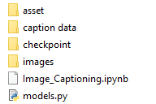
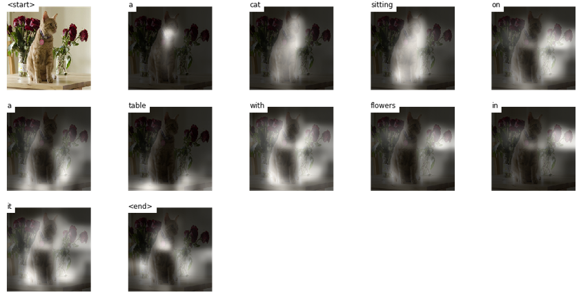
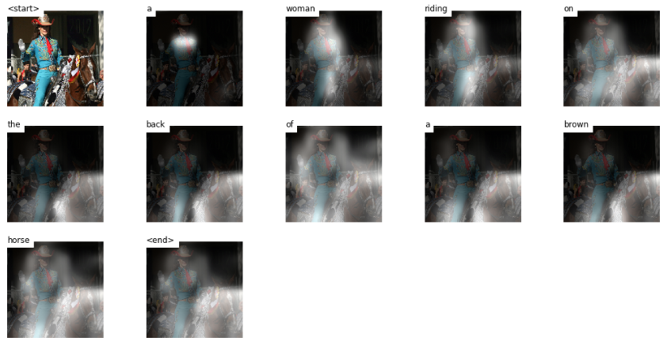

# Automatic-image-Captioning
Captioning generated by a CNN encoder (ResNet 101) and a decoder using LTSM with attention and BEAM search

## Description
The notebook re-uses a pre-trained model and part of the code developped by Sagar Vinodababu in his tutorial available on github:
https://github.com/sgrvinod/a-PyTorch-Tutorial-to-Image-Captioning

The principles were described in the paper "Show, Attend, and Tell" (https://arxiv.org/abs/1502.03044).

The model takes an image as an input, encodes its key features (Encoder based on ResNet-101 feature detection conv blocks) and uses an LTSM RNN to decode and generate a caption for the image, word by word, using BEAM search for optimal sequence.

Additionally, the areas of the picture most relevant in the prediction of each word is highlighted and displayed as part of the result.

YOu can visit Sagar Vinadababu's tutorial for a detailed walkthrough.

## Installation

The model uses pre-trained weights and word dictionary available from the author here: https://drive.google.com/open?id=189VY65I_n4RTpQnmLGj7IzVnOF6dmePC

- collect the pretrained weights and dictionary
- download the notebook
- replicate following structure

- insert your own images in an "images" folder
- run the notebook (Pytorch).

## Results

